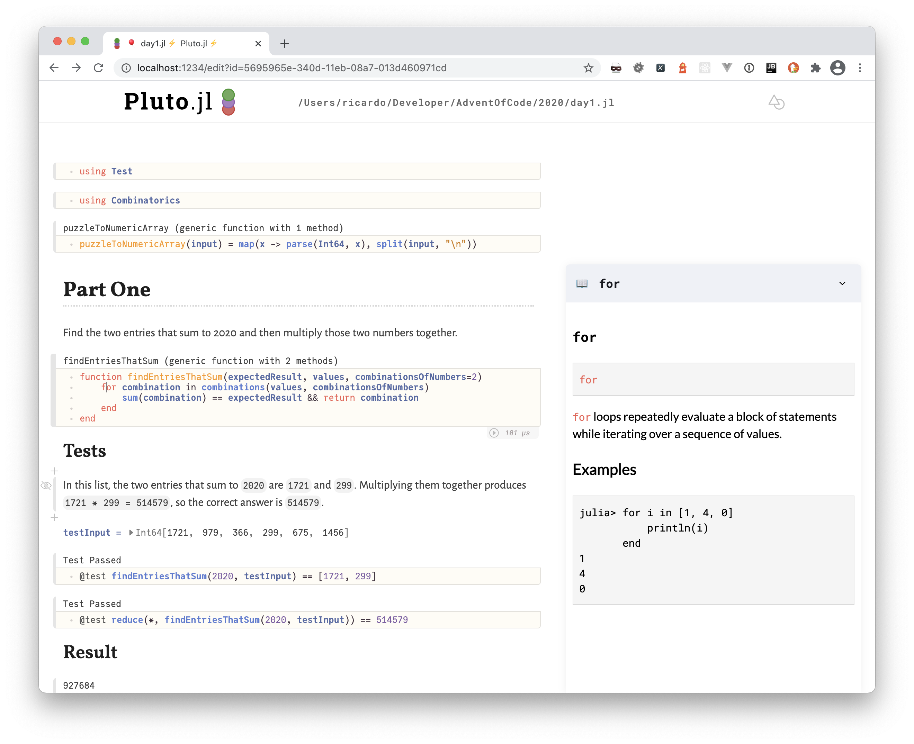

# advent-of-code-2020
Advent of Code 2020 solutions with [Julia](https://julialang.org/) and [Pluto.jl](https://github.com/fonsp/Pluto.jl). Spoiler alert!

## How to use this repository
1. Install [Julia](https://julialang.org/)
2. Add [Pluto.jl](https://github.com/fonsp/Pluto.jl) package (`pkg add Pluto`)
3. Start a Julia session
3. Include Pluto.jl (`using Pluto`)
4. Start the notebook (`Pluto.run()`)
5. You can now open my notebook files or create your own! 🎉

Happy coding!
